<div align="center">

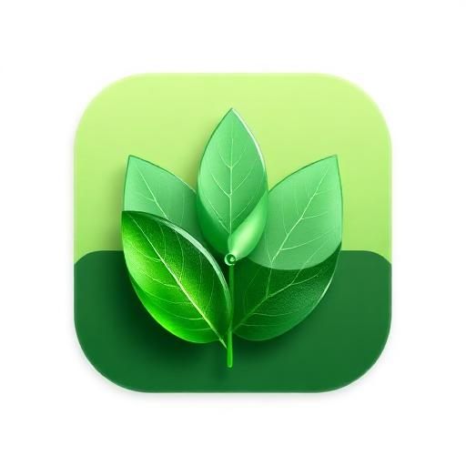

# AgriPen

### The Intelligent Soil Companion for the Next Generation of Farmers

**A Smart Agriculture Ecosystem — Portable Device · Mobile Intelligence · AI Decision Engine**

<br/>


<br/>

> _"Farmers should not guess. They should know."_

<br/>

**[ Vision ](#-vision) · [ Ecosystem ](#-what-is-agripen) · [ How It Works ](#-how-agripen-works) · [ Hardware ](#-prototype-hardware) · [ AI Engine ](#-artificial-intelligence) · [ Roadmap ](#-future-vision)**

---


</div>

<br/>

---

## 🌱 Vision

Agriculture feeds the world — yet most farming decisions today are still made through **intuition, tradition, or guesswork**.

Farmers face a growing set of challenges:

| Challenge | Reality on the Field |
| :--- | :--- |
| 🌡 **Climate volatility** | Seasons no longer follow historical patterns. |
| 💧 **Water scarcity** | Irrigation is often applied without real soil data. |
| 🧪 **Soil degradation** | Continuous cultivation depletes nutrients silently. |
| 🌾 **Yield uncertainty** | Crop failures happen without early warning. |
| 📊 **No historical memory** | Farms rarely keep structured records of their own land. |
| 🧑‍🌾 **Decision fatigue** | Farmers must make hundreds of decisions with little data. |

Traditional farming is inefficient not because farmers lack skill — but because they **lack real-time, precise, field-level information**.

**AgriPen exists to change that.**

AgriPen turns every farm into a **living, measurable, intelligent organism** — where every square meter of soil can speak, and every decision is guided by evidence.

<br/>

---

## 🧭 What is AgriPen?

**AgriPen is not a mobile application.**
**AgriPen is not a sensor.**
**AgriPen is a complete Smart Agriculture Ecosystem.**

It brings together six deeply integrated pillars into a single, unified farming intelligence platform:

<div align="center">

| 🔧 Portable Device | 📱 Mobile Application | 🧠 Artificial Intelligence |
| :---: | :---: | :---: |
| A handheld soil analyzer designed to be pushed directly into the ground. | An intuitive companion app that guides the farmer step by step. | A collaborative network of AI models producing real recommendations. |

| 🗺 Geographic Analysis | 📚 Historical Memory | 🎯 Decision Support |
| :---: | :---: | :---: |
| Every farm is mapped, bordered, and geo-referenced. | Every measurement is stored, compared, and remembered. | AgriPen tells the farmer **what to do, when, and why**. |

</div>

<br/>

### The Complete Ecosystem

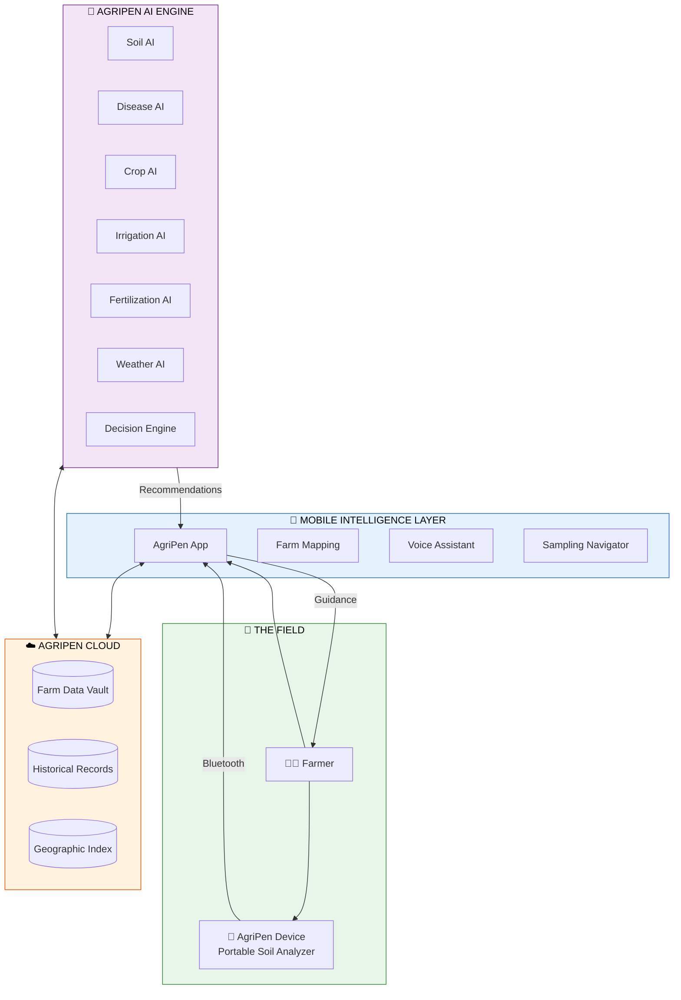

<br/>

---

## 🏗 Complete System Overview

AgriPen is built as **four cooperating intelligences** — each specialized, each essential.

```mermaid
flowchart LR
    subgraph L1["🔧 PHYSICAL LAYER"]
        direction TB
        S1["Soil Moisture Sensor"]
        S2["Temperature Sensor"]
        S3["Atmospheric Pressure"]
        S4["Microcontroller Core"]
        S5["Wireless Transmitter"]
    end

    subgraph L2["📱 INTERFACE LAYER"]
        direction TB
        U1["Farmer Dashboard"]
        U2["Farm Map View"]
        U3["Sampling Guide"]
        U4["Report Center"]
        U5["Voice Interface"]
    end

    subgraph L3["🧠 INTELLIGENCE LAYER"]
        direction TB
        A1["Soil Interpretation"]
        A2["Disease Vision"]
        A3["Crop Matching"]
        A4["Irrigation Planner"]
        A5["Fertilizer Advisor"]
        A6["Decision Fusion"]
    end

    subgraph L4["☁️ MEMORY LAYER"]
        direction TB
        D1["Farm Registry"]
        D2["Measurement Archive"]
        D3["Recommendation Log"]
        D4["Seasonal History"]
    end

    L1 ==> L2
    L2 ==> L3
    L3 ==> L4
    L4 ==> L2

    style L1 fill:#ffe0b2,stroke:#e65100,color:#000
    style L2 fill:#bbdefb,stroke:#0d47a1,color:#000
    style L3 fill:#e1bee7,stroke:#4a148c,color:#000
    style L4 fill:#c8e6c9,stroke:#1b5e20,color:#000
```

<br/>

---

## 🚶 Complete User Journey

From the moment a farmer downloads AgriPen, to the moment their farm becomes a fully mapped, intelligent, self-improving organism.

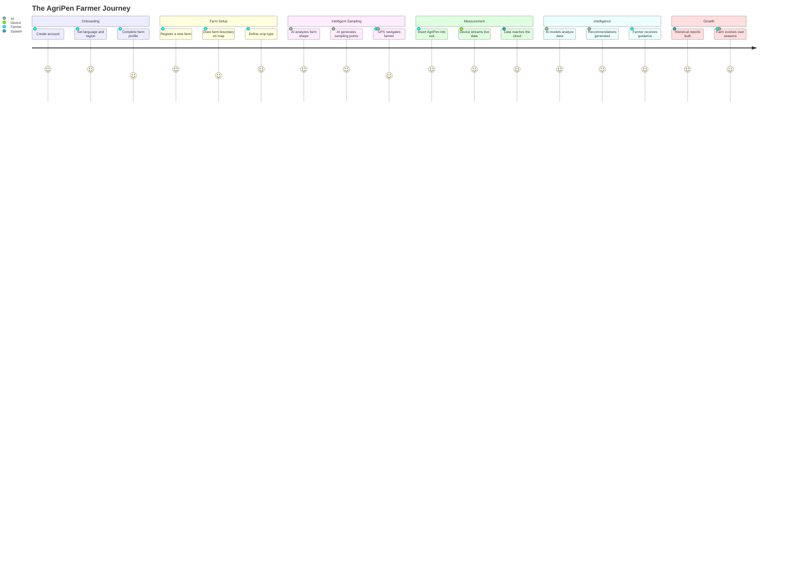

**Step by step:**

1. 🧑‍🌾 **The farmer creates an account** — simple, secure, personal.
2. 🌍 **They create their first farm** — choosing name, region, and crop.
3. ✏️ **They draw the boundary** of their land directly on a satellite map.
4. 🧠 **AgriPen AI studies the shape**, size, and geography of the farm.
5. 📍 **AI generates optimal sampling points** across the field.
6. 🚶 **GPS navigation guides the farmer** to each precise location.
7. 🔧 **The AgriPen device is inserted into the soil** at every point.
8. 📡 **Live readings are transmitted** wirelessly to the mobile application.
9. ☁️ **Data is uploaded and analyzed** by AgriPen's AI engine.
10. 🎯 **Personalized recommendations appear** — irrigation, fertilization, crop rotation, disease alerts.
11. 📑 **Reports are automatically generated** and stored.
12. 📚 **Every season adds to the farm's memory**, making AgriPen smarter over time.

<br/>

---

## ⚙️ How AgriPen Works

AgriPen operates as a continuous loop of **sensing → understanding → advising → learning**.

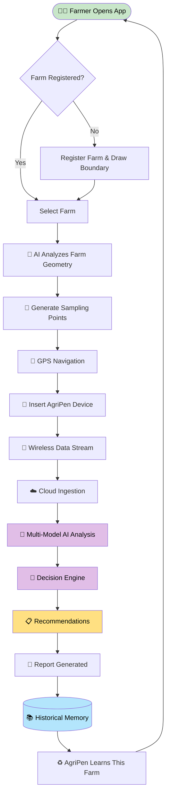

Every cycle strengthens the farm's digital twin — a living record of its soil, climate, and productivity.

<br/>

---

## 🔧 Prototype Hardware

> 💡 **Note:** The current AgriPen device is the **first-generation prototype**. It is intentionally simple, robust, and field-testable. Future versions will evolve toward professional-grade, sealed, ruggedized instruments.

<div align="center">

</div>

### Components of the Current Prototype

| Component | Role Inside AgriPen |
| :--- | :--- |
| 🧠 **ESP32 Microcontroller** | The brain of the device. Reads sensors, manages power, and streams data wirelessly to the mobile app. |
| 🌡 **DHT11 Sensor** | Measures ambient temperature and humidity around the soil sample. |
| 🌬 **BMP180 Sensor** | Captures atmospheric pressure — a critical input for weather and irrigation intelligence. |
| 💧 **YL-69 / FC-28 Probe** | The soil-facing probe. Detects moisture levels inside the ground. |
| 🔋 **Li-ion Battery** | Provides portable, rechargeable field power. |
| 🧩 **Breadboard** | Hosts the prototype circuit for rapid iteration. |
| ⚡ **Resistors** | Balance signals and protect the sensors. |
| 🔥 **Soldering Iron** | Used during assembly to build stable field-ready connections. |

### Prototype Architecture

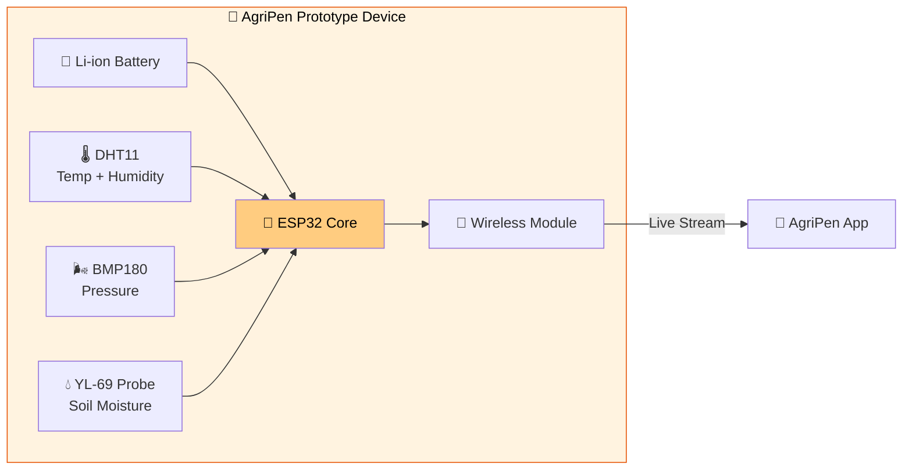

<br/>

---

## 📱 Mobile Application

The AgriPen mobile application is the **cockpit** of the entire ecosystem — the place where soil, sky, and intelligence meet the farmer.

<div align="center">

</div>

### Core Modules

| Module | Purpose |
| :--- | :--- |
| 🚜 **Farm Management** | Register, organize, and manage multiple farms and fields. |
| 🗺 **Maps** | Interactive satellite mapping, boundary drawing, and sampling navigation. |
| 🎙 **Voice Assistant** | Hands-free interaction while working in the field. |
| 🦠 **Disease Detection** | Analyze plant photos to detect diseases early. |
| 🌾 **Crop Analysis** | Understand crop suitability, health, and growth stage. |
| ☀️ **Weather** | Localized weather intelligence tailored to each farm. |
| 📑 **Reports** | Structured summaries of soil health, sampling sessions, and seasons. |
| 📚 **History** | Complete archive of every measurement, every decision, every outcome. |
| ⚙️ **Settings** | Personalization, units, language, device pairing. |
| 🔔 **Notifications** | Real-time alerts for irrigation, disease risk, and weather changes. |
| 👤 **Profile** | Farmer identity, farms owned, and preferences. |

### Application Architecture

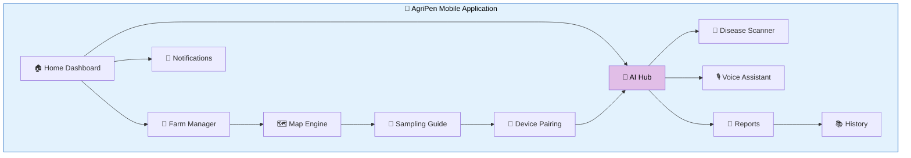

<br/>

---

## 🧠 Artificial Intelligence

AgriPen is powered by a **network of specialized AI models** — each an expert in one domain of agriculture — cooperating through a central **Decision Engine**.

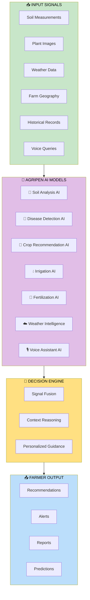

### The AgriPen AI Family

| AI Model | Function |
| :--- | :--- |
| 🧪 **Soil Analysis AI** | Interprets moisture, temperature, and pressure into meaningful soil insights. |
| 🦠 **Disease Detection AI** | Recognizes crop diseases from photographs. |
| 🌾 **Crop Recommendation AI** | Suggests the best crops for the current soil and climate. |
| 💧 **Irrigation AI** | Calculates optimal watering schedules based on real field conditions. |
| 🌱 **Fertilization AI** | Recommends nutrient balance tailored to the soil's true state. |
| ☁️ **Weather Intelligence** | Predicts localized weather impact on farming operations. |
| 🎙 **Voice Assistant AI** | Understands the farmer's spoken language in the field. |
| 🎯 **Decision Engine** | Combines all model outputs into one coherent, actionable strategy. |

<br/>

---

## 🚜 Farm Management

Every farm in AgriPen is a **first-class digital entity**.

- 🗺 **Boundary Definition** — draw exact field borders on satellite imagery.
- 📍 **GPS Anchoring** — every corner is geo-referenced.
- 🛰 **Satellite Layers** — visualize the farm from above.
- 🧩 **Field Organization** — split large farms into logical zones.
- 📚 **Historical Records** — every season contributes to the farm's biography.

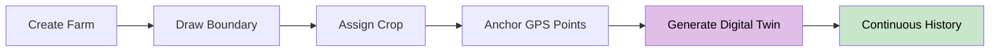

<br/>

---

## 🧪 Soil Sampling System

AgriPen does not ask the farmer to sample randomly.
AI computes **where** to sample, **why**, and **in what order**.

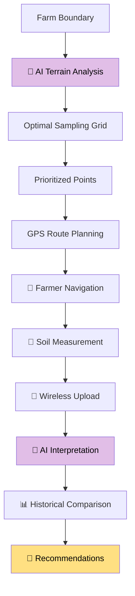

Sampling points are **not random** — they reflect terrain shape, farm size, historical anomalies, and crop needs.

<br/>

---

## 🦠 Disease Detection

<div align="center">

</div>

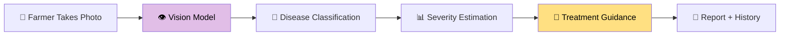

- Instant photo analysis in the field.
- Recognition of common crop diseases.
- Clear, actionable treatment recommendations.
- Every detection is stored for long-term farm health tracking.

<br/>

---

## 🎯 Recommendation Engine

AgriPen recommendations are not generic tips.
They are the **fusion output** of multiple AI models reasoning together.

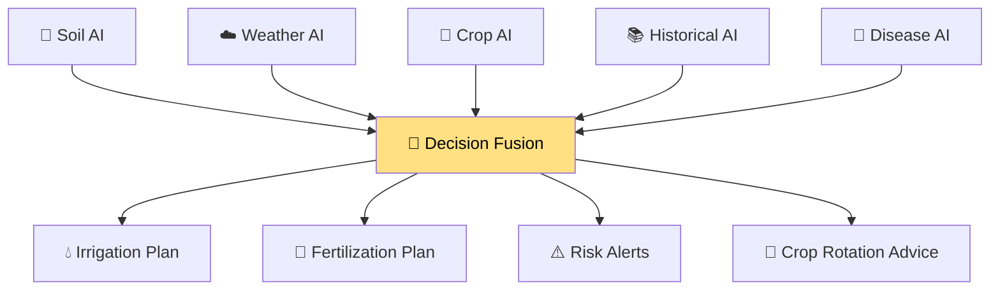

<br/>

---

## 📑 Reports

Every measurement, every AI insight, every seasonal shift becomes part of the farm's **living documentation**.

- 📊 **Structured historical reports** for every farm.
- 🔍 **Season-to-season comparisons** to reveal trends.
- 📄 **Exportable PDF reports** for personal or institutional use.
- 🌱 **Farm evolution timelines** that show land improving over time.

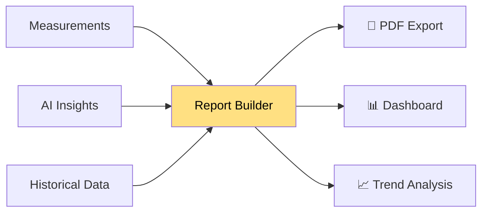

<br/>

---

## 🔒 Security

AgriPen treats agricultural data as **the farmer's private property**.

> 🛡 **Every farm belongs to its farmer. Every measurement is private. Every decision is theirs.**

- 🔐 **Encrypted communication** between device, app, and cloud.
- 👤 **Farmer-owned data** — only the farmer controls access.
- 🧱 **Isolated farm records** — no cross-account exposure.
- 🗂 **Auditable history** — every action is traceable to its origin.
- 🌍 **Regional data respect** — designed to align with agricultural data ethics.

<br/>

---

## 🛰 Future Vision

AgriPen is designed to grow. The current prototype is only the beginning.

## AgriPen Journey

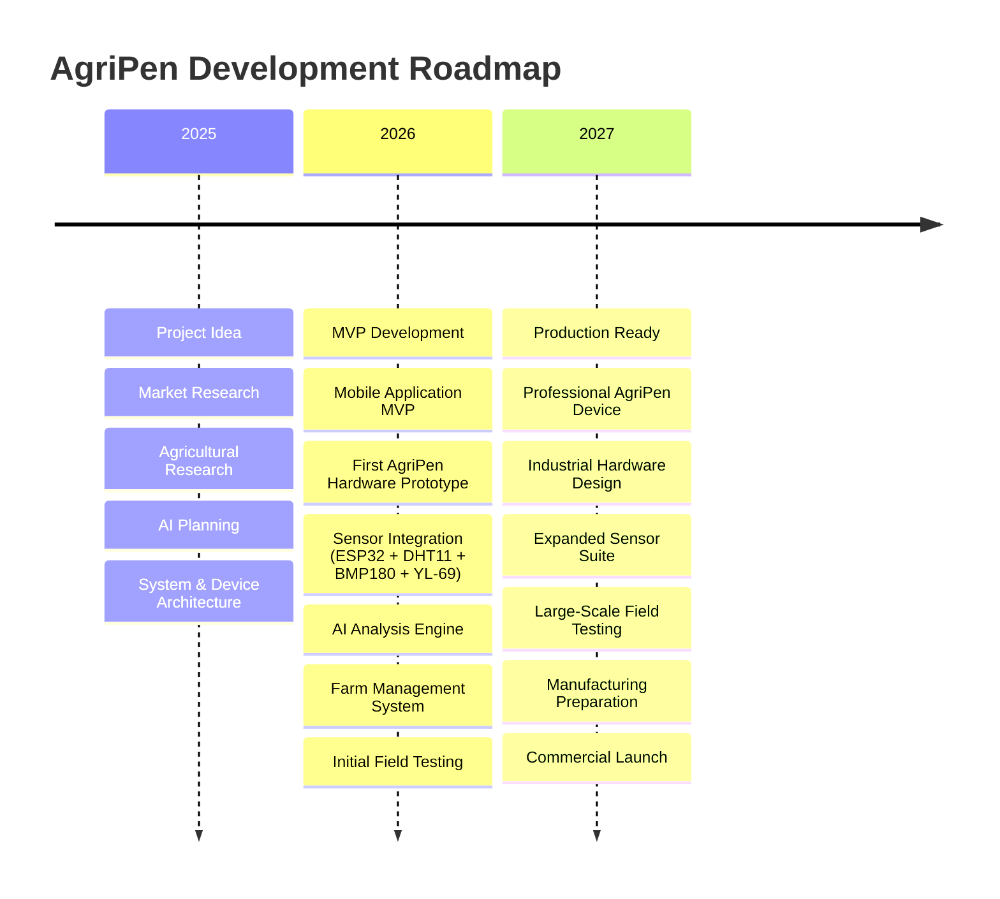

### Planned Evolution

- 🔧 Professional sealed and weatherproof AgriPen device.
- 🌱 Advanced soil analysis (pH, NPK, salinity, EC, organic matter).
- 🤖 Smarter AI models for irrigation, fertilization and crop recommendations.
- 🛰 Satellite imagery and vegetation index integration (NDVI).
- 🗺️ Multi-farm management and cooperative analytics.
- 📈 Long-term soil history and predictive agricultural insights.
- 🧑‍🌾 Voice assistant supporting additional Algerian dialects.
- 📄 Professional reports and precision agriculture dashboards.

---


## 📁 Repository Structure

Only the parts that matter for understanding AgriPen as a product.

```
agripen/
├── device/              🔧 Firmware & schematics for the AgriPen prototype
├── mobile/              📱 The AgriPen mobile application
├── ai/                  🧠 AI models and decision engine
├── cloud/               ☁️ Farm data, history, and geographic services
├── docs/                📚 Product documentation and diagrams
└── assets/              🎨 Branding, icons, and imagery
```

<br/>

---

## 🌍 Final Word

AgriPen is more than a product.
It is a **belief** — that farming, one of humanity's oldest crafts, deserves the most advanced intelligence of our time.

Every sensor. Every AI model. Every diagram. Every decision.
They all exist for one purpose:

> 🌱 **To help farmers grow more, waste less, and understand their land like never before.**

<br/>

<div align="center">

**AgriPen — The Intelligent Soil Companion.**

_Made for farmers. Powered by intelligence. Designed for the future of agriculture._

<br/>


</div>
