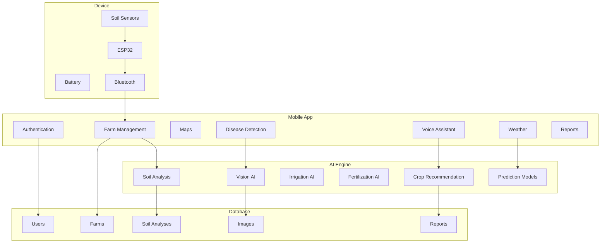

# AgriPen 

AgriPen is an intelligent agriculture ecosystem that combines a portable soil analysis device with an AI-powered mobile platform to help farmers analyze soil, monitor crops, detect plant diseases, and make data-driven agricultural decisions

## Core Features

- Multi-language interface: Arabic, French, English, Tamazight
- Multi-dialect voice control: Darija, Wahrania, Chelfia, Tlemcania, Charqia, Adraria
- Real-time soil analysis: moisture, temperature, pH, N/P/K, organic matter
- Plant disease diagnosis via camera with AI (client-side image downscaling for speed)
- Crop suitability scoring based on soil and climate
- Fertilization recommendations
- Tree analysis
- Interactive weather forecast

## Farm Mapping

- Interactive Leaflet map with OpenStreetMap and Esri satellite layers
- Multi-zone drawing: separate polygons for crop fields and tree groves, each color-coded
- Automatic hectare calculation per zone
- AI-suggested sensor point distribution inside crop zones
- Boundary extraction from a photo of a paper map
- NDVI overlay from NASA GIBS (MODIS Terra) for vegetation health at a glance
- Persistent storage as GeoJSON FeatureCollection

## AI Capabilities

- Plant disease diagnosis (Gemini vision)
- Conversational agricultural assistant
- Crop suitability analysis
- Voice command parser for hands-free navigation
- Speech-to-text and text-to-speech in Algerian dialects
- Personalized daily brief generated from farm conditions

## Progressive Web App

- Installable on iOS and Android home screens
- Full offline support with a dedicated offline fallback page
- Service Worker with tuned caching strategies:
  - Cache-first for map tiles (OSM, satellite, NDVI)
  - Cache-first for fonts and images
  - Network-first for HTML with offline shell fallback
  - Stale-while-revalidate for JavaScript and CSS assets
- Web Push notifications with VAPID
- Haptic feedback on primary interactions

## Automated Notifications

- AI-generated daily brief pushed to every subscribed user at 06:00 UTC via pg_cron
- Push subscription management from the profile page with in-app test
- Automatic cleanup of expired subscriptions

## User Experience

- Six-item bottom navigation: Home, Assistant, Farm, Disease, Crops, Profile
- Secondary sections accessible from the profile page as a bento grid: irrigation, timeline, pests, trees, weather, fertilization
- Interactive onboarding tour on first launch in all four languages
- Empty states with inline SVG illustrations
- Skeleton shimmer loading states
- Smooth page transitions between routes
- Pull-to-refresh on the home screen
- Persistent dark mode

## Design System

- Algerian earth-inspired palette: earth, olive, sky, wheat
- Typography: IBM Plex Sans Arabic and Rubik
- Glassmorphism surfaces with grain overlay
- Custom AgriPen logo and iconography
- Full RTL support

## Advanced Modules

- 7-day smart irrigation plan combining soil moisture and weather forecast
- Farm timeline logging irrigation, fertilization, harvests, and events
- Regional pest and disease early warning system with community reporting
- Achievement badges for engagement
- PDF farm report export

## Technology Stack

- TanStack Start with React 19 and Vite 7
- Tailwind CSS v4
- Supabase for database, authentication, and storage
- AI Services (Gemini API) for vision, chat, speech recognition and speech synthesis
- Leaflet with leaflet-draw for interactive mapping
- Web Push with VAPID for background notifications
- pg_cron and pg_net for scheduled server-side jobs

## Security

- Row Level Security enabled on every user-owned table
- Role-based access control via has_role security definer function
- Bearer token authentication for all server functions
- Signed webhook verification for public API endpoints
- Push subscription cleanup on expiry


## Complete System Architecture



## AgriPen Device Workflow

```mermaid
flowchart LR

A[Insert AgriPen into Soil]

A --> B[Read Sensors]

B --> C[Moisture]

B --> D[pH]

B --> E[Temperature]

B --> F[N]

B --> G[P]

B --> H[K]

C --> I[ESP32]

D --> I

E --> I

F --> I

G --> I

H --> I

I --> J[Bluetooth / Wi-Fi]

J --> K[AgriPen Mobile App]

K --> L[AI Analysis]

L --> M[Recommendations]

M --> N[Farmer]
```# agripen-app-mvp
